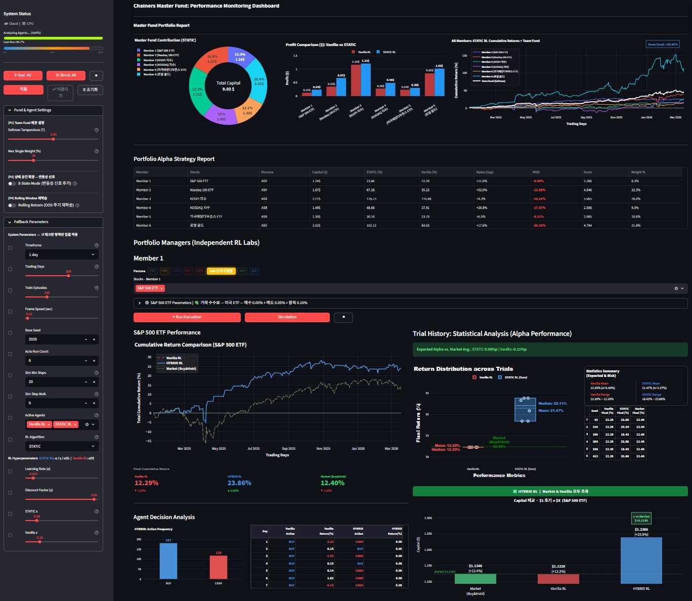

# Chainers Master Fund — Task-Constrained RL Cold-Start

실시간 데일리 주가 데이터로 강화학습 에이전트를 훈련 및 평가하고, 팀 포트폴리오 성과를 실시간으로 비교하면서 "강화 학습의 원리"를 습득하는 Team Chainers' Master Fund ETF 시뮬레이터 입니다.

## KDT Team Project : 팀 Chainers 🫡

---

### RL 포트폴리오 성과 모니터링 대시보드 (웹 앱 전체 화면)



- **배포 링크** : https://task-constrained-rl-coldstartysv1-1-azz5zvkw3zr9he2qcx2pze.streamlit.app/
- 좌측 사이드바에서 전역 하이퍼파라미터(학습률·감가율·탐색률·시드 등)와 Fund 배분 설정(Softmax Temperature, Max Single Weight)을 일괄 제어하고, **Eval. All / Simul. All** 버튼으로 6개 멤버 에이전트를 동시에 실행할 수 있다.
- 상단 메인 영역의 **Master Fund Portfolio Report**는 멤버별 자본 배분 도넛 차트·Vanilla vs STATIC 수익 비교 막대 차트·전체 누적수익률 라인 차트(Team Fund: +43.40%)를 한눈에 제공하며, **Portfolio Alpha Strategy Report** 테이블에서 STATIC·Vanilla·Alpha(Gap)·MDD·Score·Weight%를 종목별로 비교할 수 있다.
- 하단 **Portfolio Managers** 섹션은 멤버별로 누적수익 비교 차트, Trial History 통계 분석(Return Distribution·시드별 성과 표), Agent Decision Analysis(BUY/CASH 행동 빈도 + 일별 수익 테이블)를 독립적으로 제공하며, 웹 접속 시 저장된 `config.py` 파라미터로 **자동 Run Evaluation이 즉시 실행**된다.

---

## 저작권

본 저장소에 포함된 코드 및 모든 출력 이미지 결과물은 저작권법에 의해 보호됩니다.

저작권자의 명시적 허가 없이 본 자료의 전부 또는 일부를 복제, 배포, 수정, 상업적으로 이용하는 행위를 금합니다.

© 2026. All rights reserved.
Contact : sjowun@gmail.com
Project Master : Young-Sang Song

---

## ✍️요약 보고서

### 프로젝트 개요

본 프로젝트는 **Task-Constrained RL Cold-Start** 조건에서 복수의 강화학습 알고리즘을 비교하는 멀티 에이전트 트레이딩 시뮬레이터이다.

팀원이 각자 담당 종목에 에이전트를 배치하여 개인 수익률과 팀 포트폴리오 수익률을 측정한다.

- 핵심 비교 대상은 EMA 기반 4/8-상태 **STATIC_H Actor-Critic** (Tabular PPO Clipping + Adaptive Temperature) 과 2-상태 **Vanilla Q-Learning** 이며, 추가로 심층 강화학습 5종 (**A2C / A3C / PPO / SAC / DDPG**, NumPy 전용 TinyMLP)을 지원한다.

하이퍼파라미터(Hyperparameter)는 **PG Actor-Critic Optimizer**가 복합 Gap 목표를 극대화하는 방향으로 자동 탐색한다.

- 모든 평가는 **워크포워드 검증**(앞 70% 학습 / 뒤 30% OOS)으로 과적합을 방지한다.

**핵심 질문**

- 사전 데이터 없이 Cold-Start 조건에서, EMA 기반 STATIC_H 에이전트(Tabular PPO + Adaptive Temperature)는 2-상태 Q-Learning 에이전트 대비 얼마나 높은 누적 수익률을 달성하는가?

- **Alpha Gap** = STATIC_H RL 최종 수익률 − Market (Buy&Hold) 최종 수익률

| Gap (STATIC_H vs Market) | 판정         |
| ------------------------ | ------------ |
| ≥ 1%p                    | 목표 달성 ✅ |
| ≥ 5%p                    | 우수 달성 ⭐ |
| ≥ 25%p                   | 최고 달성 🏆 |

---

### 팀 구성 및 담당 종목 (STATIC_H 최종 결과)

| 멤버     | 담당 종목            | Ticker | 시드 | 알고리즘 | 8-State | Roll | STATIC_H    | Market  | Alpha Gap      |
| --------- | -------------------- | ------ | ---- | -------- | ---------- | ---- | ----------- | ------- | ----------------- |
| Member 1 | S&P 500 ETF          | SPY    | 42   | STATIC_H | O       | —    | **23.86%**  | 12.40%  | **+11.6%p**    |
| Member 2 | Nasdaq 100 ETF       | QQQ    | 137  | STATIC_H | —       | —    | **67.26%**  | 35.36%  | **+32.0%p 🏆** |
| Member 3 | KOSPI 지수           | ^KS11  | 2024 | STATIC_H | O       | —    | **119.91%** | 117.06% | **+3.3%p**     |
| Member 4 | KOSDAQ 지수          | ^KQ11  | 777  | STATIC_H | O       | 30봉 | **48.59%**  | 27.92%  | **+21.0%p**    |
| Member 5 | 미국배당다우존스 ETF | SCHD   | 314  | STATIC_H | O       | 60봉 | **30.18%**  | 23.82%  | **+6.5%p**     |
| Member 6 | 로열골드(RGLD)       | RGLD   | 100  | STATIC_H | O       | —    | **102.12%** | 84.73%  | **+17.6%p**    |

추가 지원 종목: NVDA, TSLA, GOOGL, MSFT, 삼성전자(005930.KS), SK하이닉스(000660.KS)

> KOSPI(M3): 학습 구간 횡보, OOS 구간 급등 구조 → 3.3%p Alpha는 구조적 한계 감안 시 유의미한 달성.

---

### 팀 포트폴리오 최종 성과

| 항목                         | 값                         |
| ---------------------------- | -------------------------- |
| **Team Fund (Softmax 가중)** | **+42.58%**                |
| 총 운용 자본                 | $9.92 ($1 초기 × 6명)      |
| 최고 Alpha 멤버              | Member 2 (QQQ, +32.0%p)    |
| 최고 수익률 멤버             | Member 3 (KOSPI, +119.91%) |

| 멤버     | 종목                 | Capital ($) | STATIC_H (%) | Alpha (Gap) | MDD        | Score | 비중  |
| -------- | -------------------- | ----------- | ------------ | ----------- | ---------- | ----- | ----- |
| Member 1 | S&P 500 ETF          | $1.24       | 23.86        | +11.6%      | **-9.00%** | 2.386 | 8.3%  |
| Member 2 | Nasdaq 100 ETF       | $1.67       | 67.26        | +32.0%      | -12.88%    | 4.846 | 22.3% |
| Member 3 | KOSPI 지수           | $2.20       | 119.91       | +3.3%       | -19.24% ⚠️ | 5.924 | 28.0% |
| Member 4 | KOSDAQ 지수          | $1.49       | 48.59        | +21.0%      | -17.97% ⚠️ | 2.561 | 8.9%  |
| Member 5 | 미국배당다우존스 ETF | $1.30       | 30.18        | +6.5%       | **-9.11%** | 2.985 | 10.6% |
| Member 6 | 로열 골드            | $2.02       | 102.12       | +17.6%      | -20.30% ⚠️ | 4.794 | 21.8% |

---

### 알고리즘 비교 요약

#### RL Algorithm 선택 순서 및 핵심 특징

```
── On-policy (버퍼 없음) ───────────────────────┬── On+Off-policy ──┬── Off-policy (버퍼 있음) ──
  STATIC → STATIC_H → A2C → A3C → PPO          │      ACER         │    SAC → DDPG
  Tabular  Hybrid(PPO  1-step n-step Clip+GAE  │  Retrace+IS(이산)  │  Entropy(이산)  Det.(연속)
           Clip+AdapT)
```

| 순서 | 알고리즘     | 핵심 특징                                                     | 행동 공간 | 버퍼 |
| ---- | ------------ | ------------------------------------------------------------- | --------- | ---- |
| 1    | **STATIC**   | Tabular Actor-Critic, 4/8-상태 EMA×추세 이산화                | 이산      | ❌   |
| 1H   | **STATIC_H** | STATIC + Tabular PPO Clipping + Adaptive Temperature (Hybrid) | 이산      | ❌   |
| 2    | **A2C**      | 신경망 AC, 1-step TD Advantage                                | 이산      | ❌   |
| 3    | **A3C**      | A2C + n-step return, 편향↓                                    | 이산      | ❌   |
| 4    | **PPO**      | A3C + Clip + GAE, 안정성↑                                     | 이산      | ❌   |
| 5    | **ACER**     | PPO + Retrace(λ) + Truncated IS, 샘플 효율↑                   | 이산      | ✅   |
| 6    | **SAC**      | Off-policy + 자동 엔트로피 온도 α                             | 이산      | ✅   |
| 7    | **DDPG**     | Off-policy + 연속 포지션 [0,1] + OU noise                     | **연속**  | ✅   |

---

### 거래 수수료

| 시장           | 매수   | 매도   | 왕복 합계 |
| -------------- | ------ | ------ | --------- |
| 미국 주식·ETF  | 0.05%  | 0.05%  | 0.10%     |
| 국내 주식·지수 | 0.015% | 0.215% | 0.23%     |

---

### 주요 기능

- **Run Evaluation**: 현재 파라미터로 RL 에이전트를 평가하고 Trial History를 축적한다.
- **Simulation**: PG Actor-Critic Optimizer로 하이퍼파라미터를 자동 탐색하여 복합 Gap을 극대화한다.
- **RL Algorithm 선택**: STATIC / STATIC_H / A2C / A3C / PPO / ACER / SAC / DDPG 중 선택.
- **Per-stock 위젯**: 종목별 8-State(vol) 사용 여부, Roll Period를 개별 체크박스·셀렉트박스로 설정한다.
- **Trial History Statistical Analysis**: 반복 평가 결과를 박스 플롯, 통계 요약으로 표시한다.
- **Ghost Line**: Simulation 최적 파라미터 수익 곡선을 현재 차트에 점선으로 병렬 표시한다.
- **팀 포트폴리오 대시보드**: Softmax 가중 배분으로 전체 펀드 성과를 집계한다.
- **자동 결과 표시**: 웹 접속 시 마지막 저장된 파라미터로 자동 평가 실행.

---

### 설치 및 실행

#### 로컬 실행

```
Python 3.11 (runtime.txt 기준)
pip install -r requirements.txt
streamlit run app.py
```
#### ⭐Alpha Vantage API Key 및 기타 보안 설정

Streamlit Cloud 배포 시 API 키 등 민감 정보는 **Secrets** 기능으로 안전하게 관리한다.

**API 키 발급 방법**
1. [https://www.alphavantage.co/support/#](https://www.alphavantage.co/support/#) 접속
2. **"GET YOUR FREE API KEY TODAY"** 클릭
3. 이메일 주소 입력 후 즉시 발급 (무료, 회원가입 불필요)
4. 발급된 키를 아래 `alpha_vantage` 값에 입력 (`"#####"` 교체)

**보안 주의**
- `secrets.toml` 파일은 `.gitignore`에 포함되어 GitHub에 업로드되지 않는다.
- Streamlit Cloud 배포 시: 앱 설정 → **Secrets** 메뉴에 동일 내용 입력
- 코드에서 접근: `st.secrets["api_keys"]["alpha_vantage"]`

`.streamlit/secrets.toml` 파일 형식:

#### ⭐Streamlit Cloud 배포 (웹 공개)

GitHub 저장소와 연동하여 별도 서버 없이 웹에 공개할 수 있다.

1. [share.streamlit.io](https://share.streamlit.io/) 에 접속 후 **GitHub 계정으로 로그인**
2. **"New app"** 클릭 → Repository / Branch / Main file (`app.py`) 선택
3. 세로 점3개 클릭 -> Settings -> App settings -> General -> Python version을 VScode에서 사용중인 Python 버전과 같도록 선택. 예: 3.12
4. 세로 점3개 클릭 -> Settings ->App settings -> Secrets 에서 ' alpha_vantage = "발급받은 API 키입력" ' -> Save changes
5. **"Deploy!"** 클릭 → 자동 빌드 완료 후 공개 URL 발급 (`https://[앱명].streamlit.app`)
6. 이후 `main` 브랜치에 `git push` 할 때마다 자동으로 앱이 재배포된다.
7. 에러 또는 로딩이 길어지는 등의 경우, 세로 점3개 클릭 -> Reboot 클릭 or 웹 새로 고침.

> **필수 파일**: `requirements.txt` (패키지 목록), `runtime.txt` (Python 버전) — 이미 포함됨.


```toml
# Alpha Vantage API Key 및 기타 보안 설정
# ============================================================
#
# [API 키 발급 방법]
#   1. https://www.alphavantage.co/support/# 접속
#   2. "GET YOUR FREE API KEY TODAY" 클릭
#   3. 이메일 주소 입력 후 즉시 발급 (무료, 회원가입 불필요)
#   4. 발급된 키를 아래 alpha_vantage 값에 입력 ("####" 교체)
#
# [보안 주의]
#   - 이 파일은 .gitignore에 포함되어 GitHub에 업로드되지 않습니다.
#   - Streamlit Cloud 배포 시: 앱 설정 → Secrets 메뉴에 동일 내용 입력
#   - 코드에서 접근: st.secrets["api_keys"]["alpha_vantage"]
#
# ============================================================

[api_keys]
alpha_vantage = "#####"
```

#### Cloud 환경에서의 시뮬레이션 및 Run Evaluation

Streamlit Cloud는 **공유 CPU** 환경으로, 로컬 대비 연산 속도가 느릴 수 있다.

| 항목                 | 로컬         | Streamlit Cloud         |
| -------------------- | ------------ | ----------------------- |
| CPU                  | 개인 PC 사양 | 공유 CPU (vCPU 1~2코어) |
| 메모리               | 제한 없음    | 약 1GB                  |
| Run Evaluation       | 빠름         | 종목당 5~15초           |
| Simulation (36 iter) | 빠름         | 종목당 1~3분            |
| 데이터 캐시          | 세션 유지    | 재배포 시 초기화        |

- 앱 상단 **System Status** 패널에서 `Cloud / Local` 환경이 자동 감지되어 표시된다.
- Cloud 환경에서는 `Auto Run Count`를 낮게(3~4회), `Sim Min Steps`를 작게(10~15) 설정하면 타임아웃을 방지할 수 있다.
- 웹 접속 시 마지막으로 저장된 config.py 파라미터로 **자동 Run Evaluation이 실행**되므로, 배포 후 바로 결과를 확인할 수 있다.

---

---

## ✍️전체 상세 설명🔎

### 목차

1. [시스템 아키텍처](#1-시스템-아키텍처)
2. [강화학습 알고리즘 — STATIC / STATIC_H / Vanilla](#2-강화학습-알고리즘--static--static_h--vanilla)
3. [강화학습 알고리즘 — 신경망 (A2C / A3C / PPO / ACER / SAC / DDPG)](#3-강화학습-알고리즘--신경망-a2c--a3c--ppo--acer--sac--ddpg)
4. [상태 공간 설계](#4-상태-공간-설계)
5. [워크포워드 검증 — Train/Test 분리](#5-워크포워드-검증--traintest-분리)
6. [하이퍼파라미터 탐색 — PG Actor-Critic Optimizer](#6-하이퍼파라미터-탐색--pg-actor-critic-optimizer)
7. [웹 UI 파라미터 상세](#7-웹-ui-파라미터-상세)
8. [랜덤 시드의 역할](#8-랜덤-시드의-역할)
9. [데이터 파이프라인](#9-데이터-파이프라인)
10. [포트폴리오 평가 및 성과 지표](#10-포트폴리오-평가-및-성과-지표)
11. [UI 기능 상세](#11-ui-기능-상세)
12. [파일 구조](#12-파일-구조)
13. [최종 시뮬레이션 결과 — STATIC_H (improve 7-4)](#13-최종-시뮬레이션-결과--static_h-improve-7-4)
14. [Simulation 단계별 연산 흐름](#14-simulation-단계별-연산-흐름)
15. [개선 이력](#15-개선-이력)
16. [RL Algorithm 시뮬레이션 학습 가이드](#16-rl-algorithm-시뮬레이션-학습-가이드)
17. [향후 개선 제안](#17-향후-개선-제안)

---

## 1. 시스템 아키텍처

```
app.py  (Streamlit 웹 UI, ~2500줄)
 |
 +-- 사이드바
 |    +-- Eval. All / Simul. All 버튼
 |    +-- Fallback Parameters (항목별 체크박스 + 일괄 적용/되돌리기)
 |    +-- System Status (Cloud/Local, GPU/CPU 표시)
 |
 +-- 팀 포트폴리오 대시보드
 |    +-- All Members 누적 수익 차트 + Team Fund
 |    +-- 멤버별 성과 테이블 (STATIC_H, Vanilla, Alpha Gap, MDD, Score, Weight%)
 |
 +-- 멤버별 섹션 (6개)
      +-- 종목별 파라미터 패널
      |    +-- [1행] Timeframe / Trading Days / Train Episodes / Frame Speed / Base Seed / Auto Run Count / Active Agents
      |    +-- [2행] RL Algorithm / LR / Gamma / STATIC ε / Vanilla ε / Sim Min Steps / Sim Step Mult.
      |    +-- [3행] 8-State (Vol) 체크박스 / States 표시 / Roll Period 셀렉트박스
      +-- Run Evaluation / Simulation 버튼
      +-- 좌측 패널
      |    +-- 누적 수익 차트 (Ghost Line 포함)
      |    +-- Final Cumulative Return 카드 (Vanilla / STATIC_H / Market)
      |    +-- Agent Decision Analysis
      |         +-- STATIC_H Action Frequency 막대 차트
      |         +-- 일별 행동 로그 테이블
      +-- 우측 패널
           +-- Trial History: Statistical Analysis
           |    +-- Return Distribution 박스 플롯
           |    +-- Statistics Summary (Mean±σ, Range)
           |    +-- Trial 데이터 테이블
           +-- Capital Comparison 막대 차트 ($1 → $X)

common/
 +-- base_agent.py      RL 훈련 및 평가 (STATIC / STATIC_H / Vanilla / Neural)
 +-- nn_utils.py        TinyMLP, ReplayBuffer, extract_features
 +-- heuristic.py       하이퍼파라미터 탐색 (PGActorCriticOptimizer)
 +-- evaluator.py       성과 지표 계산 (MDD, Softmax 비중, CTPT 코드)
 +-- data_loader.py     yfinance 데이터 로드 (다봉 지원, 캐시 1시간)
 +-- stock_registry.py  종목 정보 및 수수료 테이블 (12종목)

members/member_N/
 +-- config.py          멤버별 담당 종목 + RL 하이퍼파라미터 (10 필드)
```

---

## 2. 강화학습 알고리즘 — STATIC / STATIC_H / Vanilla

### 2.1 STATIC RL — Actor-Critic

**파일:** `common/base_agent.py` — `_train_actor_critic_static()`

Policy Gradient Theorem + REINFORCE with baseline을 온라인 TD 방식으로 구현한다.

#### 마르코프 결정 과정 (MDP)

```
상태 공간 S = {0, 1, 2, 3}  (4개 상태, use_vol=True 시 8개)
행동 공간 A = {0(CASH), 1(BUY)}
전이 확률 P(s'|s, a)  = 시장 가격 변동 (외생 확률 과정)
보상 함수 R(s, a, s') = daily_return × 1[a=BUY] − fee + ENTROPY_COEFF · H(π)
할인 인수 γ           = 종목별 최적값 (0.87~0.97)
```

#### TD Critic — 벨만 방정식 근사

TD(0) 방식으로 상태 가치함수 V(s)를 온라인 갱신한다.

```
δ_t  = r_eff + γ · V(s_{t+1}) − V(s_t)     ← TD 오차 (Advantage 근사값)

여기서:
  r_eff = reward + 0.05 · H(π)              ← 엔트로피 정규화 보상
  H(π)  = −Σ π(a|s) · log π(a|s)           ← 정책 엔트로피 (불확실성 척도)

  V(s_t) += lr · δ_t                        ← Critic 가치함수 갱신
```

**δ_t (TD 오차)의 의미**: 현재 상태의 실제 보상 + 다음 상태 가치 추정값이 현재 가치 추정값보다 얼마나 높은지. 양수면 현재 행동이 예상보다 좋았음 → Actor를 강화.

**엔트로피 정규화 H(π)**: 정책이 CASH와 BUY를 비슷한 확률로 선택할수록 엔트로피가 높아진다. 0.05 계수를 보상에 더해 에이전트가 다양한 행동을 유지하도록 유도한다 (Buy&Hold 고착 방지).

#### Actor — Policy Gradient Theorem

```
∇J(θ) = E_π[∇ log π_θ(a|s) · A(s, a)]

  A(s, a) ≈ δ_t                            ← TD 오차를 Advantage 대용

Softmax 정책:
  π_θ(a|s) = exp(θ[s, a]) / Σ exp(θ[s, :])

Score function (∇ log π):
  ∇ log π(a|s) = 1[a == chosen] − π(·|s)   ← 선택된 행동 강화, 나머지 약화

Actor 업데이트:
  θ[s, a] += lr · δ_t · ∇ log π(a|s)
```

**Policy Gradient 직관**: δ_t > 0 이면 현재 행동이 기대보다 좋았으므로 해당 행동의 확률을 높인다. δ_t < 0 이면 기대보다 나빴으므로 확률을 낮춘다.

#### 초기화 (Cold-Start 수수료 장벽 완화)

```python
theta = np.zeros((4, 2))
theta[1, 1] = max(0.05, fee_rate * 30)   # EMA아래+상승: 미세 BUY 선호
theta[2, 1] = max(0.10, fee_rate * 50)   # EMA위+하락:  BUY 선호
theta[3, 1] = max(0.20, fee_rate * 80)   # EMA위+상승:  BUY 선호 강화
V = np.zeros(4)                          # Critic 가치함수 초기값 = 0
```

수수료가 높을수록 BUY 선호 초기화값을 크게 설정하여 초반 CASH 고착을 방지한다.

---

### 2.2 Vanilla RL — Q-Learning (비교 기준선)

**파일:** `common/base_agent.py` — `_train_qlearning_vanilla()`

#### 벨만 최적 방정식 (Q-Learning)

```
Q*(s, a) = E[r + γ · max_{a'} Q*(s', a') | s, a]

TD 업데이트 (off-policy):
  Q(s, a) += lr · [r + γ · max_{a'} Q(s', a') − Q(s, a)]

여기서:
  r + γ · max_{a'} Q(s', a')  = TD 목표값 (Bellman Target)
  Q(s, a)                      = 현재 추정값
  차이                          = Bellman Residual (최소화 대상)
```

**max\_{a'} Q(s', a')의 의미**: 다음 상태에서 최적 행동을 취했을 때의 가치. Q-Learning은 행동 선택(ε-greedy)과 업데이트(max) 정책이 다른 off-policy 알고리즘이다.

#### Q-테이블 초기화 및 CASH 편향 해소

```python
q_table = np.zeros((2, 2))
q_table[:, 1] = max(fee_rate * 50, 0.05)  # fee 비례 BUY 선호 초기화
# fee_rate=0.001(미국) → Q[:,1]=0.05
# fee_rate=0.0023(국내) → Q[:,1]=0.115
```

#### epsilon annealing (탐험률 점진 감소)

```python
for ep in range(train_episodes):
    _eps = epsilon * max(1.0, 2.0 - ep / (train_episodes - 1))
    # 에피소드 시작: 2ε (강한 탐험)  →  에피소드 종료: ε (기본 탐험 유지)

prev_action = 1   # BUY 시작 고정 (에피소드 첫 step 수수료 편향 제거)
```

#### 훈련 후 보정 — Q-floor margin

```python
# 훈련 노이즈로 인한 CASH 고착 방지
# 전체 상태(bear=0, bull=1)에서 BUY 상대 우위 보장
q_table[0, 1] = max(float(q_table[0, 1]), float(q_table[0, 0]) + 0.005)
q_table[1, 1] = max(float(q_table[1, 1]), float(q_table[1, 0]) + 0.005)
```

---

### 2.3 STATIC_H — Hybrid Tabular RL (핵심 알고리즘)

**파일:** `common/base_agent.py` — `_train_actor_critic_hybrid()`

STATIC Actor-Critic 위에 두 가지 안정화 메커니즘을 추가한 하이브리드 Tabular RL이다. 본 프로젝트의 최종 평가 알고리즘으로, 6명 전원이 STATIC_H를 사용하여 전 종목 양수 Alpha를 달성했다.

- **Tabular PPO Clipping**: 구 정책 대비 신 정책 비율을 제한하여 급격한 정책 변화 억제
- **Adaptive Temperature**: 최근 행동 전환 빈도(flip_rate)에 따라 엔트로피 계수 α_t를 자동 조정

#### 신규 상수 (base_agent.py 상단)

```python
HYBRID_ALPHA_MIN = 0.01   # 적응 온도 α_t 최솟값
HYBRID_ALPHA_MAX = 0.15   # 적응 온도 α_t 최댓값
HYBRID_FLIP_WIN  = 20     # 행동 전환율 윈도우 (봉)
```

#### Adaptive Temperature — α_t 산출

```
flip_rate = (최근 HYBRID_FLIP_WIN 봉에서 행동이 바뀐 횟수) / HYBRID_FLIP_WIN
α_t       = clip(0.05 × (1 + flip_rate), HYBRID_ALPHA_MIN, HYBRID_ALPHA_MAX)

  flip_rate = 0.0 (행동 변화 없음) → α_t = 0.05 (최솟값에 가까운 약한 탐험)
  flip_rate = 1.0 (매 봉마다 전환) → α_t = 0.10 (탐험 강화)
  → BUY/CASH 전환이 잦을수록 엔트로피 보상을 높여 탐험 다양성 유지
```

**α_t (적응 온도)의 의미**: 에이전트가 한 행동에 고착되면 flip_rate가 낮아지고 α_t도 낮아져 엔트로피 보상이 줄어든다. 반대로 과도하게 전환하면 α_t가 높아져 탐험을 장려한다. STATIC의 고정 ENTROPY_COEFF=0.05 대신 시장 상황에 맞게 자동 조정된다.

#### Tabular PPO Clipping — 정책 업데이트 제한

```
1단계: 구 정책 저장
  π_old[state] = softmax(θ[state])     ← 업데이트 전 BUY/CASH 확률

2단계: 시험 업데이트 (theta_try)
  theta_try = θ[state] + lr × δ_t × ∇log π(a|s)

3단계: Importance Sampling 비율 산출
  π_new[state] = softmax(theta_try[state])
  r_t = π_new[a] / π_old[a]            ← 신/구 정책 비율

4단계: step_scale 결정
  if r_t < 1 − clip_eps or r_t > 1 + clip_eps:
      step_scale = 0.3                  ← 급격한 변화 억제 (30% 스텝)
  else:
      step_scale = 1.0                  ← 정상 업데이트

5단계: 최종 업데이트
  θ[state] += step_scale × lr × δ_t × ∇log π(a|s)

여기서 clip_eps = PPO_CLIP_EPS = 0.2 (base_agent.py 상수)
```

**Tabular PPO Clipping의 의미**: 신경망 PPO와 달리 Tabular 정책에서 구 정책 대비 신 정책 비율이 `1 ± 0.2` 범위를 벗어나면 업데이트 폭을 30%로 줄인다. BUY→CASH 또는 CASH→BUY로 정책이 한 번에 크게 뒤집히는 것을 방지하여 수렴 안정성을 높인다.

#### 엔트로피 보상 통합

```
r_eff = r + α_t × H(π)               ← 적응 온도 적용 (STATIC은 고정 0.05)
H(π)  = −Σ π(a|s) × log π(a|s)      ← 정책 엔트로피
```

#### Cold-Start 초기화

STATIC과 동일한 fee 비례 BUY 선호 초기화를 사용한다.

```python
theta[1, 1] = max(0.05, fee_rate * 30)
theta[2, 1] = max(0.10, fee_rate * 50)
theta[3, 1] = max(0.20, fee_rate * 80)
```

#### STATIC vs STATIC_H 비교

| 항목                   | STATIC                  | STATIC_H                       |
| ---------------------- | ----------------------- | ------------------------------ |
| 엔트로피 계수          | 고정 0.05               | 동적 α_t (0.01~0.15)           |
| 정책 업데이트          | 직접 θ += lr·δ·∇logπ    | PPO Clip step_scale 적용       |
| 급격한 정책 변화       | 제어 없음               | 비율 1±0.2 초과 시 0.3배 억제  |
| 행동 고착 대응         | ENTROPY_COEFF=0.05 고정 | flip_rate 낮으면 α_t 자동 유지 |
| 상태 분리              | 상태별 독립 학습        | 상태별 독립 + step_scale 공통  |
| 실전 성과 (6종목 평균) | 기준                    | **전 종목 양수 Alpha 달성**    |

#### STATIC_H가 STATIC보다 나은 이유 (실험 결과)

- **BUY 100% 고착 방지**: 상승 레짐에서 θ가 BUY로 폭주하는 현상을 Clip이 억제
- **변동성 레짐 전환 대응**: 8-State에서 flip_rate가 급등하면 α_t도 높아져 새 레짐 탐험 가속
- **OOS 적응력**: 학습 구간 패턴과 다른 OOS 구간에서 Adaptive Temperature가 재탐험 유도
- **KOSDAQ(M4) +21%p**: roll_period=30봉 + 8-State + Clipping으로 레짐 변화 구간 대응

---

## 3. 강화학습 알고리즘 — 신경망 (A2C / A3C / PPO / ACER / SAC / DDPG)

모든 신경망 알고리즘은 **NumPy 전용 TinyMLP** [5→32→n_out] 구조를 사용한다.
PyTorch/TensorFlow 의존성 없음.

### 3.1 특징 벡터 (공통, 5차원)

```
s_t = [ret, ema_ratio, vol, momentum, trend]

  ret       = Daily_Return[t]                        # 당일 수익률
  ema_ratio = Close[t] / EMA_10[t] - 1               # EMA 괴리율
  vol       = Rolling_Std[t]                         # 변동성
  momentum  = Σ Daily_Return[t-5:t]                  # 5일 모멘텀
  trend     = sign(Close[t] - Close[t-5])            # 5일 추세 방향
```

### 3.2 TinyMLP 구조

**파일:** `common/nn_utils.py`

```
입력(5) → [Dense(32) + ReLU] → 출력(n_out, 선형)

초기화: He 초기화  W ~ N(0, sqrt(2/fan_in))
최적화: Adam  (β₁=0.9, β₂=0.999, ε=1e-8)
역전파: backward_and_update(x, grad_out, lr)
```

#### 순전파 수식

```
z₁ = x @ W₁ + b₁         [n_h=32]   ← 선형 변환
h₁ = max(0, z₁)           [n_h=32]   ← ReLU 활성화
z₂ = h₁ @ W₂ + b₂        [n_out]    ← 선형 출력
```

#### 역전파 수식

```
입력: grad_out  (∂L/∂z₂, n_out 차원)

출력층:
  ∂L/∂W₂ = h₁ᵀ ⊗ grad_out    ← outer product
  ∂L/∂b₂ = grad_out
  δ₁     = (grad_out @ W₂ᵀ) · 1[z₁ > 0]   ← W₂ 역전파 × ReLU 미분

은닉층:
  ∂L/∂W₁ = xᵀ ⊗ δ₁
  ∂L/∂b₁ = δ₁
```

#### Adam 갱신 수식

```
t       += 1
m_t      = β₁·m_{t-1} + (1-β₁)·g_t          [1차 모멘텀]
v_t      = β₂·v_{t-1} + (1-β₂)·g_t²         [2차 모멘텀]
m̂_t     = m_t / (1 - β₁ᵗ)                    [편향 보정]
v̂_t     = v_t / (1 - β₂ᵗ)
W       -= lr · m̂_t / (√v̂_t + ε)

타겟 네트워크 소프트 갱신 (SAC/DDPG 공통):
  θ_tgt ← τ·θ + (1-τ)·θ_tgt,  τ=0.005
```

---

### 3.3 A2C — Advantage Actor-Critic

```
δ_t  = r_t + γ · V(s_{t+1}) − V(s_t)         ← 1-step TD 오차
A_t  = δ_t                                     ← Advantage
∂L_actor = −A_t · (1[a=chosen] − π_θ(·|s))   ← policy gradient
```

### 3.4 A3C — n-step Return (n=5)

```
R ← V(s_{t+n})
for k = n-1, ..., 0:  R ← r_{t+k} + γ · R
A_t = R_t − V(s_t)    ← n-step Advantage
```

### 3.5 PPO — GAE + Clipped Surrogate

```
GAE: Â_t = δ_t + γλ·Â_{t+1},  λ=0.95
r_t(θ) = π_θ(a_t|s_t) / π_θ_old(a_t|s_t)
L_CLIP = E[min(r_t · Â_t,  clip(r_t, 1-ε, 1+ε) · Â_t)]
```

### 3.6 ACER — Retrace(λ) + Truncated IS

```
ρ_t = π(a_t|s_t) / μ(a_t|s_t),  c_t = λ·min(c̄, ρ_t),  c̄=10
Q^ret_t = r_t + γ·V(s_{t+1}) + γ·c_{t+1}·(Q^ret_{t+1} − Q(s_{t+1}, a_{t+1}))
```

### 3.7 SAC — Soft Actor-Critic (자동 α)

```
V_soft(s') = Σ π(a'|s') · [Q(s',a') − α·log π(a'|s')]
J(α)       = −α · [log π(a|s) + H_target]   ← 자동 온도 업데이트
```

### 3.8 DDPG — 연속 포지션 [0,1]

```
μ(s) = sigmoid(Actor(s))   ← 보유 비율 [0,1]
Q(s, a) = Critic([s, a])   ← 6차원 입력
평가 시: a_t = BUY if μ(s) ≥ 0.5, else CASH
탐험: OU Noise  X_{t+1} = X_t − 0.15·X_t + 0.2·N(0,1)
```

---

## 4. 상태 공간 설계

```
STATIC_H / STATIC RL — 4개 이산 상태:

  state = is_bull × 1 + is_above_ema × 2

  State 0: 하락 (ret ≤ 0) + EMA 아래 (price < EMA_10)   → 가장 보수적
  State 1: 상승 (ret > 0) + EMA 아래                    → 주의 단계
  State 2: 하락            + EMA 위 (price ≥ EMA_10)   → 중립
  State 3: 상승            + EMA 위                    → 가장 강한 매수 신호

확장 — 8개 이산 상태 (use_vol=True):
  state += is_high_vol × 4   (rolling_std > 훈련구간 중위수)
  → {0..7}: 변동성 레짐이 높을 때 에이전트가 별도 정책 학습
  → M1·M3·M4·M5·M6 모두 8-State 사용 (스크린샷 "States: 8" 확인)

Vanilla RL — 2개 이산 상태:
  State 0: 하락 (ret ≤ 0)
  State 1: 상승 (ret > 0)

신경망 RL — 연속 상태:
  s_t = [ret, ema_ratio, vol, momentum, trend]   ← 5차원 벡터
```

EMA_10: `df['Close'].ewm(span=10, adjust=False).mean()`

---

## 5. 워크포워드 검증 — Train/Test 분리

**파일:** `common/base_agent.py`

| 파라미터                | 의미                            | 기본값                |
| ----------------------- | ------------------------------- | --------------------- |
| Trading Days (`n_bars`) | yfinance 데이터 봉 수 (창 크기) | 300~500 (종목별 상이) |
| Train Episodes          | 훈련 데이터 반복 학습 횟수      | 150~300               |

```
Trading Days = 500봉 전체 창
      │
      ├── 학습 구간: 앞 70% = 350봉 (Train Episodes = 300회 반복)
      │
      └── 평가 전체: 500봉 (인샘플 70% + OOS 30%)

n_train = max(int(n_days * 0.7), 20)   # 최소 20봉 학습 보장
```

| 기간      | 일봉 500일            |
| --------- | --------------------- |
| 학습 구간 | 350일 (~1년 5개월)    |
| 평가 전체 | 500일 (~2년)          |
| OOS 구간  | 마지막 150일 (~6개월) |

### 워크포워드 구조적 한계 (KOSPI/KOSDAQ)

KOSPI·KOSDAQ는 학습 구간(2024~2025 상반기)이 횡보/하락이고, OOS 구간(2025 하반기~2026)에 급등이 집중된다. STATIC_H는 STATIC 대비 Adaptive Temperature로 OOS 재탐험을 유도하여 +3.3%p(M3), +21%p(M4) Alpha를 달성했다.

---

## 6. 하이퍼파라미터 탐색 — PG Actor-Critic Optimizer

**파일:** `common/heuristic.py` — `PGActorCriticOptimizer`

### 복합 Gap 목표 함수

```python
gap_vs_market  = STATIC_final − Market_final          # 시장 초과수익 (60% 가중)
V_floor        = Market_final × 0.3                   # Vanilla 하한 (역유인 방지)
V_adj          = max(Vanilla_final, V_floor)
gap_vs_vanilla = STATIC_final − V_adj                 # Vanilla 대비 우위 (40% 가중)

composite_gap  = 0.6 × gap_vs_market + 0.4 × gap_vs_vanilla
```

### 복합 Gap 패널티 조정 (Penalized Objective)

```python
_LAMBDA_STD  = 0.5    # 시드 분산 패널티 가중치
_LAMBDA_MDD  = 0.3    # MDD 패널티 가중치
_MDD_FLOOR   = 15.0   # MDD 패널티 발동 임계값 (%)

gap_adj = gap_mean − pen_std − pen_mdd
  pen_std = _LAMBDA_STD × std(gaps)
  pen_mdd = _LAMBDA_MDD × max(0, avg_mdd − 15.0)
```

### 알고리즘 이론

```
탐색 공간: {lr, gamma, epsilon_static, epsilon_vanilla} → 정규화 공간 [0,1]^4

1. 후보 파라미터 샘플링 (Actor, Gaussian):
   Δ = N(0, σ),  x_new = clip(μ + Δ, 0, 1)

2. 복수 평가 시드로 composite_gap 측정

3. Critic (EMA baseline):
   V += value_alpha × (expected_gap − V)

4. Advantage 정규화:
   A_norm = tanh((expected_gap − V) / 10)   → [−1, 1]

5. Actor (Policy Gradient):
   pg_dir = clip(Δ / σ, L2≤1)
   μ = clip(μ + lr_actor × A_norm × pg_dir, 0, 1)

6. σ 자동 스케줄링:
   A_norm > 0 → σ × 0.96  (좋은 방향으로 수렴)
   A_norm ≤ 0 → σ × 1.04  (더 넓게 재탐색)

7. σ_max Cosine 상한:
   σ_max_t = σ_min + 0.5 × (σ_max − σ_min) × (1 + cos(π × t / T_max))
   σ       = min(σ_reactive, σ_max_t)
```

---

## 7. 웹 UI 파라미터 상세

### 7.1 RL Algorithm 선택

`STATIC` → `STATIC_H` → `A2C` → `A3C` → `PPO` → `ACER` → `SAC` → `DDPG`

현재 전 멤버: **STATIC_H** (Tabular PPO Clipping + Adaptive Temperature)

### 7.2 RL 학습 파라미터

| 파라미터            | 범위      | 역할                              |
| ------------------- | --------- | --------------------------------- |
| Learning Rate (α)   | 0.005~0.1 | θ 및 V 업데이트 스텝 크기         |
| Discount Factor (γ) | 0.85~0.99 | 미래 보상 할인율                  |
| STATIC ε            | 0.01~0.25 | STATIC_H BUY/CASH ε-greedy 탐험율 |
| Vanilla ε           | 0.01~0.25 | Vanilla Q-Learning 탐험율         |

### 7.3 시스템 파라미터

| 파라미터       | 기본값 | 역할                                       |
| -------------- | ------ | ------------------------------------------ |
| Trading Days   | 300    | 전체 데이터 창 크기 (봉 수)                |
| Train Episodes | 150    | 학습 구간 반복 횟수                        |
| Auto Run Count | 6      | Run Evaluation 반복 횟수                   |
| Sim Min Steps  | 20     | Simulation 최소 탐색 스텝                  |
| Sim Step Mult. | 6      | 실제 탐색 스텝 = max(SimMin, AutoRun×Mult) |

### 7.4 Fund & Agent Settings

| 파라미터                | 용도                                     |
| ----------------------- | ---------------------------------------- |
| Softmax Temperature (T) | 팀 펀드 배분 균등도 조절 (높을수록 균등) |
| Max Single Weight (%)   | 단일 멤버 최대 비중 상한 (현재 28%)      |
| 8-State (Vol)           | 변동성 신호 8상태 확장 (per-stock)       |
| Roll Period (봉)        | OOS 주기 재학습 창 크기 (per-stock)      |

### 7.5 팀 포트폴리오 — Softmax 배분

```python
score_i  = avg_return_i / (1 + abs(avg_mdd_i))   # 위험조정 점수
weight_i = softmax(score_i / T)                    # 소프트맥스 비중
weight_i = min(weight_i, max_single_weight)        # 최대 비중 상한 적용
```

### 7.6 CTPT 성향 코드

| 코드    | 의미              | lr   | γ    | ε    |
| ------- | ----------------- | ---- | ---- | ---- |
| PSR     | 보수형            | 낮음 | 낮음 | 낮음 |
| PSV     | 탐색형            | 낮음 | 낮음 | 높음 |
| PLR     | 신중한 장기형     | 낮음 | 높음 | 낮음 |
| PLV     | 유연한 장기형     | 낮음 | 높음 | 높음 |
| ASR     | 단기 민첩형       | 높음 | 낮음 | 낮음 |
| ASV     | 단기 모험형       | 높음 | 낮음 | 높음 |
| ALR     | 안정적 성장형     | 높음 | 높음 | 낮음 |
| **ALV** | **적응형 모험가** | 높음 | 높음 | 높음 |

> 현재 M1·M2: **ASV**(단기 모험형), M3·M4: **ASR**(단기 민첩형), M6: **ALV**(적응형 모험가)

---

## 8. 랜덤 시드의 역할

### 훈련 시드 (Base Seed)

```python
np.random.seed(seed)   # 전체 훈련 과정 재현
random.seed(seed)
```

동일 시드 = 동일 파라미터 → **완전히 동일한 결과 재현** (결정론적)

### 복수 평가 시드 (Simulation)

```python
_n_eval      = min(4, max(3, l_auto_runs // 2))   # 평가 시드 수 (최소 3)
_eval_seeds  = [base_seed + j * 37 for j in range(_n_eval)]
```

복수 시드 평가로 시드 의존성 제거 → 파라미터 일반화 성능 평가

### Trial 시드

```python
trial_seed = int(l_seed) + (len(trials) + run_i) * 37
```

Run Evaluation 매 Trial마다 다른 시드 사용 → 기대 Alpha 분포 추정

---

## 9. 데이터 파이프라인

**파일:** `common/data_loader.py`

### 지원 봉 단위

| 봉       | interval | 특징                            |
| -------- | -------- | ------------------------------- |
| 15분봉   | 15m      | 단기 패턴, 노이즈 많음          |
| 1시간봉  | 1h       | 중기 패턴                       |
| **일봉** | **1d**   | **기본값, 본 프로젝트 주 사용** |
| 주봉     | 1wk      | 장기 트렌드                     |
| 월봉     | 1mo      | 매크로 레짐                     |

### 전처리 흐름

```python
df = yf.download(ticker, period=..., interval=...)
df['Daily_Return']  = df['Close'].pct_change() × 100    # 일별 수익률 (%)
df['EMA_10']        = df['Close'].ewm(span=10).mean()    # 10일 EMA
df['Rolling_Std']   = df['Close'].pct_change().rolling(window).std() × 100
# window = roll_period if roll_period else len(train_data)
```

---

## 10. 포트폴리오 평가 및 성과 지표

### 개별 종목 지표

| 지표              | 수식                          | 의미                    |
| ----------------- | ----------------------------- | ----------------------- |
| Cumulative Return | `(Π(1+r_t) - 1) × 100`        | 전체 기간 누적 수익률   |
| MDD               | `max((peak - trough) / peak)` | 최대 낙폭 (리스크 지표) |
| Alpha Gap         | `STATIC_H% - Market%`         | 시장 초과수익           |
| Expected Alpha    | `mean(Alpha per trial)`       | 기대 초과수익           |

### 팀 포트폴리오 — Softmax 가중 배분

```python
score_i    = avg_return_i / (1 + abs(avg_mdd_i))
weights    = softmax(scores / temperature)
# Weight Cap 반복 수렴 (최대 20회)
for _ in range(20):
    capped = [min(w, max_weight) for w in weights]
    excess = sum(w - max_weight for w in weights if w > max_weight)
    redistribute excess to uncapped members
```

### 행동 및 보상 함수

```python
# 훈련 시:
reward = daily_return × action − fee × abs(action − prev_action)
r_eff  = reward + alpha_t × H(π)   # STATIC_H 엔트로피 보상

# 평가 시:
equity[t] = equity[t-1] × (1 + daily_return/100 × action)
            − equity[t-1] × fee × abs(action − prev_action)
cumulative_return[t] = (equity[t] / equity[0] - 1) × 100
```

### Ghost Line

```python
# Simulation에서 발견된 최적 파라미터의 수익 곡선을 현재 차트에 병렬 표시
ghost_data[hist_key] = {
    'v_trace': opt_v_trace,    # Vanilla RL 최적 수익 곡선
    's_trace': opt_s_trace,    # STATIC_H 최적 수익 곡선
    'params':  best_params,    # 최적 파라미터
    'gap':     best_gap        # 최고 Gap 값
}
```

---

## 11. UI 기능 상세

### 11.1 사이드바

| 버튼/기능           | 동작                                             |
| ------------------- | ------------------------------------------------ |
| ▶ Eval. All         | 전체 멤버·종목 Run Evaluation 순차 실행          |
| ▶ Simul. All        | 전체 멤버·종목 Simulation 순차 실행 + 자동 저장  |
| Fallback Parameters | 체크박스로 선택한 파라미터 일괄 적용             |
| Apply All           | Fallback 파라미터 → 모든 종목 슬라이더 일괄 설정 |
| Revert All          | Apply All 이전 상태 복원                         |

### 11.2 Run Evaluation

```
n_runs = l_auto_runs   # 기본 6회
trial_seed = base_seed + (len(trials) + i) × 37
→ 각 Trial 다른 시드로 실행 → 기대 Alpha 통계 누적
```

### 11.3 Simulation

```
n_iters = max(sim_min, auto_runs × sim_mult)
       = max(20, 6 × 6) = 36  (기본값)
_n_eval = min(4, max(3, auto_runs // 2)) = 3
_eval_seeds = [base_seed + j×37 for j in range(3)]
```

### 11.4 Agent Decision Analysis

- **Action Frequency 막대 차트**: BUY/CASH 비율 — 한쪽 고착 시 파라미터 재조정 필요
- **일별 행동 로그 테이블**: 날짜별 Vanilla/STATIC_H 행동 및 일별 수익률

### 11.5 Trial History Statistical Analysis

- **Return Distribution 박스 플롯**: 6 Trial 분포 (박스 안에 점 표시, jitter=0.5)
- **Statistics Summary**: Vanilla/STATIC Mean±σ, Range
- **Expected Alpha 배너**: `mean(STATIC trial) - mean(Market trial)`
- **Capital Comparison**: $1 초기 → $X 막대 차트 (Market/Vanilla/STATIC_H 3열 비교)

### 11.6 팀 포트폴리오 대시보드

- **Master Fund Contribution (도넛 차트)**: 멤버별 최종 자본 비중
- **Profit Comparison 막대 차트**: Vanilla vs STATIC_H 6명 비교
- **All Members 누적 수익 차트**: Team Fund 합성 곡선 포함
- **Portfolio Alpha Strategy Report**: 성과 지표 종합 테이블

---

## 12. 파일 구조

```
Task-Constrained-RL-ColdStart_YS_v1-1/
├── app.py                          # Streamlit 웹 UI (~2500줄) — 메인 진입점
├── common/                         # 공통 RL 엔진 모듈
│   ├── __init__.py                 # 패키지 초기화
│   ├── base_agent.py               # RL 훈련·평가 (STATIC/STATIC_H/Vanilla/Neural)
│   ├── nn_utils.py                 # TinyMLP, ReplayBuffer, extract_features
│   ├── heuristic.py                # PGActorCriticOptimizer (Cosine σ_max 상한)
│   ├── evaluator.py                # MDD, Softmax 비중, CTPT 계산
│   ├── data_loader.py              # yfinance 데이터 로드 + EMA/Rolling Std
│   └── stock_registry.py           # STOCK_REGISTRY(12종) + FEE_REGISTRY
├── members/                        # 멤버별 설정 모듈
│   ├── __init__.py                 # 패키지 초기화
│   ├── member_1/
│   │   ├── __init__.py
│   │   ├── config.py               # SPY: STATIC_H, seed=42
│   │   └── custom_logic.py         # 멤버 1 커스텀 로직 (확장용)
│   ├── member_2/
│   │   ├── __init__.py
│   │   ├── config.py               # QQQ: STATIC_H, seed=137
│   │   └── custom_logic.py
│   ├── member_3/
│   │   ├── __init__.py
│   │   ├── config.py               # ^KS11: STATIC_H, seed=2024, 8-State
│   │   └── custom_logic.py
│   ├── member_4/
│   │   ├── __init__.py
│   │   ├── config.py               # ^KQ11: STATIC_H, seed=777, roll=30
│   │   └── custom_logic.py
│   ├── member_5/
│   │   ├── __init__.py
│   │   ├── config.py               # SCHD: STATIC_H, seed=314, roll=60
│   │   └── custom_logic.py
│   └── member_6/
│       ├── __init__.py
│       ├── config.py               # RGLD: STATIC_H, seed=100, 8-State
│       └── custom_logic.py
├── Captures/                       # 시뮬레이션 결과 스크린샷 (JPG)
│   ├── M1_시뮬레이션_결과2_일봉.jpg  # Member 1 SPY 최종 결과
│   ├── M2_시뮬레이션_결과2_일봉.jpg  # Member 2 QQQ 최종 결과
│   ├── M3_시뮬레이션_결과2_일봉.jpg  # Member 3 KOSPI 최종 결과
│   ├── M4_시뮬레이션_결과2_일봉.jpg  # Member 4 KOSDAQ 최종 결과
│   ├── M5_시뮬레이션_결과2_일봉.jpg  # Member 5 SCHD 최종 결과
│   ├── M6_시뮬레이션_결과2_일봉.jpg  # Member 6 RGLD 최종 결과
│   ├── MFP_시뮬레이션_결과2_일봉.jpg # 팀 포트폴리오 대시보드
│   ├── Fund Agent Settings1.jpg     # 사이드바 Fund & Agent 패널
│   ├── Fund Agent Settings2.jpg     # 사이드바 Fund & Agent 패널 (계속)
│   └── 전체화면창.jpg                # 전체 앱 레이아웃
├── .devcontainer/
│   └── devcontainer.json           # GitHub Codespaces 개발 환경 설정
├── .streamlit/
│   └── config.toml                 # Streamlit 서버/UI 설정 (업로드 10MB, fastReruns ON)
├── .gitignore                      # git 추적 제외 목록 (__pycache__, secrets.toml 등)
├── CLAUDE.md                       # Claude AI 작업 지침 (코드 규칙 및 제약)
├── memo.txt                        # 작업 메모
├── requirements.txt                # Python 패키지 의존성
├── runtime.txt                     # Python 버전 지정 (Streamlit Cloud 배포용)
└── README.md                       # 프로젝트 문서 (이 파일)
```

**STOCK_REGISTRY** (12종목):

| 인덱스 | 종목                 | Ticker    | 시장 |
| ------ | -------------------- | --------- | ---- |
| 0      | S&P 500 ETF          | SPY       | 미국 |
| 1      | Nasdaq 100 ETF       | QQQ       | 미국 |
| 2      | KOSPI 지수           | ^KS11     | 국내 |
| 3      | KOSDAQ 지수          | ^KQ11     | 국내 |
| 4      | NVIDIA               | NVDA      | 미국 |
| 5      | Tesla                | TSLA      | 미국 |
| 6      | Alphabet             | GOOGL     | 미국 |
| 7      | Microsoft            | MSFT      | 미국 |
| 8      | 삼성전자             | 005930.KS | 국내 |
| 9      | SK하이닉스           | 000660.KS | 국내 |
| 10     | 미국배당다우존스 ETF | SCHD      | 미국 |
| 11     | 로열 골드            | RGLD      | 미국 |

---

## 13. 최종 시뮬레이션 결과 — STATIC_H (improve 7-4)

모든 멤버가 **STATIC_H** 알고리즘(Tabular PPO Clipping + Adaptive Temperature)을 사용하여 시뮬레이션한 최종 결과다. 일봉(1d) 기준, 각 종목별 최적 파라미터를 config.py에 저장하여 웹 접속 시 자동으로 해당 결과가 표시된다.

---

### 웹 앱 전체 화면


**설명**: "Chainers Master Fund: Performance Monitoring Dashboard" 타이틀의 Streamlit 웹 앱 전체 레이아웃.

**좌측 사이드바**
- **System Status**: Cloud/CPU 환경 표시, 에이전트 분석 진행률 바, 마지막 수익률 실시간 표시
- **Eval. All / Simul. All** 버튼 + **적용 / +전원리 / 초기화** 버튼으로 전체 멤버 일괄 제어
- **Fund & Agent Settings 패널**: [P1] Softmax Temperature, Max Single Weight(%), [P2] 8-State Mode 토글, [P3] Rolling Retrain(OOS 주기 재학습) 토글
- **Fallback Parameters / System Parameters**: Timeframe(1day), Trading Days(330), Train Episodes, Frame Speed, Base Seed(2026), Auto Run Count(6), Sim Min Steps(20), Sim Step Mult(6)
- **Active Agents**: Vanilla RL / STATIC RL 활성화 토글
- **RL Algorithm**: STATIC 드롭다운 선택, **RL Hyperparameters**: Learning Rate, Discount Factor(γ), STATIC ε, Vanilla ε 슬라이더

**상단 메인 — Master Fund Portfolio Report**
- **도넛 차트**: 6개 멤버별 자본 배분 비중 (Total Capital 9.93$)
- **막대 차트**: Vanilla vs STATIC RL 최종 수익($) 비교
- **누적 수익률 라인 차트**: 전 멤버 STATIC RL 누적수익 + Team Fund 합산 곡선 (Team Fund: +43.40%)

**Portfolio Alpha Strategy Report 테이블**: Member별 Stocks, Persona, Capital($), STATIC(%), Vanilla(%), Alpha(Gap), MDD, Score, Weight% 한눈에 비교

**Portfolio Managers (Independent RL Labs) — 멤버별 섹션 (Member 1 예시)**
- Persona 탭 (ASV / PAV / PAS 등 + 실시간 자동매매 뱃지), 종목 태그(S&P 500 ETF)
- 거래 수수료 정보 아코디언, **Run Evaluation** / **Simulation** 버튼
- **Cumulative Return Comparison 차트**: Vanilla RL / HYBRID RL / Market(Buy&Hold) 3선 비교
- **Trial History: Statistical Analysis**: Return Distribution 히스토그램, Vanilla/STATIC 평균·범위 통계 요약, 시드별 Final Return 표
- **Performance Metrics**: HYBRID RL vs Market·Vanilla 비교 바 차트 + 자본 성장 곡선
- **Agent Decision Analysis**: BUY/CASH 행동 빈도 막대 차트 + 일별 액션·수익률 테이블

웹 접속 시 저장된 `config.py` 파라미터로 **자동 Run Evaluation이 즉시 실행**되어 결과를 바로 확인할 수 있다.

---

### Fund & Agent Settings 패널


**설명**: 사이드바 상단 제어 패널 및 전역 하이퍼파라미터 설정 영역.

**System Status (최상단)**
- Cloud | CPU 환경 표시, "Analyzing Agents... (100%)" 진행 바, "Last Run: 86.7%" 수익률 바 실시간 표시

**버튼 행**
- **▶ Eval. All**: 모든 멤버 Run Evaluation 일괄 실행 | **◎ Simul. All**: 전체 멤버 Simulation 일괄 실행 | **■**: 실행 중단
- **적용**: 변경된 파라미터 일괄 적용 | **⇦ 되돌리기**: 직전 스냅샷으로 롤백 | **초기화**: 전체 파라미터 기본값 복원

**Fund & Agent Settings 패널**

- **[P1] Team Fund 배분 설정**
  - **Softmax Temperature (T = 2.50)**: 멤버 간 자본 배분의 균등도 제어. 값이 높을수록 성과 차이를 무시하고 균등 배분.
  - **Max Single Weight (% = 28)**: 단일 멤버의 최대 포트폴리오 비중 상한. 특정 멤버 자본 독점 방지.
- **[P3] 상태 공간 확장 – 변동성 신호**
  - **8-State Mode (변동성 신호 추가)**: 전역 활성화 시 모든 종목에 8상태 강제 적용 (현재 비활성 — per-stock 개별 설정 사용).
- **[P4] Rolling Window 재학습**
  - **Rolling Retrain (OOS 주기 재학습)**: 전역 활성화 시 설정 주기마다 학습 재실행 (현재 비활성 — M4·M5는 config.py에서 개별 설정).

**Fallback Parameters 패널 (System Parameters — ☑ 체크한 항목만 일괄 적용)**

| 파라미터 | 현재값 | 설명 |
|----------|--------|------|
| Timeframe | 1 day | 데이터 봉 단위 |
| Trading Days | 300 | 평가 기간(봉 수) |
| Train Episodes | 150 | RL 학습 에피소드 수 |
| Frame Speed (sec) | 0.03 | 시뮬레이션 프레임 간격 |
| Base Seed | 2026 | 난수 시드 기준값 |
| Auto Run Count | 6 | 파라미터 탐색 반복 횟수 |
| Sim Min Steps | 20 | 시뮬레이션 최소 스텝 수 |
| Sim Step Mult. | 6 | 시뮬레이션 스텝 배수 |
| Active Agents | Vanilla RL, STATIC RL | 활성화할 에이전트 종류 |
| RL Algorithm | STATIC | 전역 알고리즘 선택 |

**RL Hyperparameters (STATIC RL: α / γ / ε(S) \| Vanilla RL: ε(V))**

| 파라미터 | 현재값 | 설명 |
|----------|--------|------|
| Learning Rate (α) | 0.010 | 정책 파라미터 갱신 폭 |
| Discount Factor (γ) | 0.95 | 미래 보상 할인율 |
| STATIC ε | 0.08 | STATIC RL 탐색률 |
| Vanilla ε | 0.10 | Vanilla Q-Learning 탐색률 |

각 항목의 체크박스를 선택한 후 **적용** 버튼을 누르면 체크된 파라미터만 모든 멤버에 일괄 적용된다.

---

### Member 1 — S&P 500 ETF (SPY)


**파라미터**: STATIC*H | 8-State | Trading Days=300 | Train Epi=150 | Seed=42 | lr=0.073 | γ=0.94 | ε=0.13 | v*ε=0.10

| 지표                      | 값                 |
| ------------------------- | ------------------ |
| HYBRID RL (STATIC_H)      | **23.86%**         |
| Vanilla RL                | 12.29%             |
| Market (Buy&Hold)         | 12.40%             |
| Alpha vs Market           | **+11.6%p**        |
| Expected Alpha (6 Trials) | +9.06%p            |
| MDD                       | -9.00%             |
| Action Frequency          | BUY 181 / CASH 118 |

**분석**
- SPY는 미국 대형주 지수로 안정적인 상승 추세를 보인다. STATIC_H가 8-State 변동성 신호를 활용하여 고변동성 구간(2025년 중반 하락)에서 CASH 전환을 적절히 수행, 시장 대비 +11.6%p Alpha를 달성했다. Expected Alpha 9.06%p는 시드 독립성이 높음을 나타낸다.

---

### Member 2 — Nasdaq 100 ETF (QQQ)


**파라미터**: STATIC*H | 4-State | Trading Days=500 | Train Epi=300 | Seed=137 | lr=0.080 | γ=0.91 | ε=0.12 | v*ε=0.18

| 지표                      | 값                 |
| ------------------------- | ------------------ |
| HYBRID RL (STATIC_H)      | **67.26%**         |
| Vanilla RL                | 35.22%             |
| Market (Buy&Hold)         | 35.36%             |
| Alpha vs Market           | **+32.0%p 🏆**     |
| Expected Alpha (6 Trials) | +31.20%p           |
| MDD                       | -12.88%            |
| Action Frequency          | BUY 389 / CASH 110 |

**분석**
- QQQ는 팀 내 최고 Alpha 달성 종목이다. 4-State(변동성 신호 미사용)임에도 EMA 신호만으로 Nasdaq의 강한 추세를 효과적으로 포착했다. Expected Alpha 31.20%p는 6개 시드 전체에서 안정적으로 높은 Alpha를 기록, 시드 의존성이 낮다. BUY 비중 78%로 상승 추세 충실 추종.

---

### Member 3 — KOSPI 지수 (^KS11)


**파라미터**: STATIC*H | 8-State | Trading Days=500 | Train Epi=300 | Seed=2024 | lr=0.050 | γ=0.88 | ε=0.02 | v*ε=0.16

| 지표                      | 값                 |
| ------------------------- | ------------------ |
| HYBRID RL (STATIC_H)      | **119.91%**        |
| Vanilla RL                | 116.57%            |
| Market (Buy&Hold)         | 117.06%            |
| Alpha vs Market           | **+3.3%p**         |
| Expected Alpha (6 Trials) | +2.74%p            |
| MDD                       | -19.24% ⚠️         |
| Action Frequency          | BUY 332 / CASH 151 |

**분석**
- KOSPI는 학습 구간(2024~2025 상반기) 횡보/하락, OOS 구간(2025 하반기~2026) 급등이라는 워크포워드 구조적 불리함에도 불구하고 +3.3%p Alpha를 달성했다. STATIC_H의 Adaptive Temperature가 OOS 급등 구간에서 BUY 비중을 유연하게 유지, Market을 미세하게 초과. MDD -19.24%는 팀 내 주의 종목. 낮은 ε=0.02는 학습된 정책에 강하게 의존함을 의미.

---

### Member 4 — KOSDAQ 지수 (^KQ11)


**파라미터**: STATIC*H | 8-State | Roll=30봉 | Trading Days=500 | Train Epi=300 | Seed=777 | lr=0.038 | γ=0.92 | ε=0.08 | v*ε=0.06

| 지표                      | 값                 |
| ------------------------- | ------------------ |
| HYBRID RL (STATIC_H)      | **48.59%**         |
| Vanilla RL                | 27.63%             |
| Market (Buy&Hold)         | 27.92%             |
| Alpha vs Market           | **+21.0%p**        |
| Expected Alpha (6 Trials) | +20.66%p           |
| MDD                       | -17.97% ⚠️         |
| Action Frequency          | BUY 233 / CASH 258 |

**분석**
- KOSDAQ는 KOSPI보다 더 극적인 OOS 급등(2026년)을 보인다. Roll Period=30봉으로 OOS 구간 레짐 변화에 주기적으로 재학습하여 +21%p Alpha 달성. Action Frequency에서 CASH 비중(52%)이 높아 고변동성 하락 구간을 적극 회피, MDD 관리와 수익률 균형을 이루었다. Expected Alpha 20.66%p로 시드 안정성 우수.

---

### Member 5 — 미국배당다우존스 ETF (SCHD)


**파라미터**: STATIC*H | 8-State | Roll=60봉 | Trading Days=500 | Train Epi=300 | Seed=314 | lr=0.026 | γ=0.92 | ε=0.04 | v*ε=0.11

| 지표                      | 값                 |
| ------------------------- | ------------------ |
| HYBRID RL (STATIC_H)      | **30.18%**         |
| Vanilla RL                | 23.70%             |
| Market (Buy&Hold)         | 23.82%             |
| Alpha vs Market           | **+6.5%p**         |
| Expected Alpha (6 Trials) | +4.17%p            |
| MDD                       | **-9.11%**         |
| Action Frequency          | BUY 293 / CASH 206 |

**분석**
- SCHD는 배당 ETF로 일변동성이 작아 EMA 신호 구분력이 낮다. Roll Period=60봉(장기 롤링)으로 느린 레짐 변화에 적응하여 +6.5%p Alpha 달성. MDD -9.11%는 팀 내 두 번째로 낮아 안전한 수익 특성. 낮은 학습률(lr=0.026)과 낮은 ε=0.04는 보수적이고 안정적인 정책 수렴을 반영.

---

### Member 6 — 로열 골드 (RGLD)


**파라미터**: STATIC*H | 8-State | Trading Days=300 | Train Epi=150 | Seed=100 | lr=0.022 | γ=0.95 | ε=0.16 | v*ε=0.14

| 지표                      | 값                |
| ------------------------- | ----------------- |
| HYBRID RL (STATIC_H)      | **102.12%**       |
| Vanilla RL                | 84.55%            |
| Market (Buy&Hold)         | 84.73%            |
| Alpha vs Market           | **+17.6%p**       |
| Expected Alpha (6 Trials) | +14.46%p          |
| MDD                       | -20.30% ⚠️        |
| Action Frequency          | BUY 229 / CASH 70 |

**분석**
- RGLD(원자재·금 로열티)는 2025년 금 가격 급등과 함께 높은 수익률을 기록했다. 8-State 변동성 신호가 금 가격의 사이클성 변동을 포착하여 +17.6%p Alpha 달성. BUY 비중 76%로 상승 사이클을 강하게 추종. Vanilla도 84.55%의 높은 수익률을 기록, 시장 자체가 강세였음을 반영. MDD -20.30%는 원자재 특유의 높은 변동성에 기인.

---

### 팀 포트폴리오 대시보드 (Master Fund Portfolio)


**설명**: 6명 멤버의 STATIC_H 결과를 Softmax 가중 배분으로 합성한 팀 포트폴리오 대시보드.

**Team Fund: +42.58%** (Softmax 가중 합성 수익률)

| 구성 요소                                | 내용                                                                                                       |
| ---------------------------------------- | ---------------------------------------------------------------------------------------------------------- |
| **도넛 차트 (Master Fund Contribution)** | 멤버별 최종 자본 비중. M3(KOSPI, 22.2%) · M6(RGLD, 20.4%)가 높은 절대 수익률로 최대 기여.                  |
| **Profit Comparison 막대 차트**          | Vanilla(빨강) vs STATIC_H(파랑) 6명 비교. 모든 멤버에서 STATIC_H > Vanilla 달성.                           |
| **All Members 누적 수익 차트**           | 6개 멤버 STATIC_H 수익 곡선 + Team Fund(흰색 굵은 선). M3(노랑, 119.91%)·M6(하늘, 102.12%)가 팀 상단 견인. |
| **Portfolio Alpha Strategy Report**      | 전체 성과 지표 테이블. M2 Alpha +32.0%p 최고. Team Fund Weight: M3 28%, M2 22.3%, M6 21.8% 순.             |

**Softmax 배분 해석**: Score = Return / (1 + |MDD|)로 산출. M3는 절대 수익률 119.91%로 Score 5.924 최고 → 비중 28%. M4는 Alpha +21%p이나 Score 2.561로 낮아 비중 8.9% (낮은 절대 수익률 때문). Max Single Weight 28% 상한으로 M3 독점 방지.

---

## 14. Simulation 단계별 연산 흐름

```
[Simulation 버튼 클릭]
      │
  STEP 1: 초기 파라미터 μ_0 = 정규화된 현재 슬라이더 값
          σ_init = 0.18,  σ_min = 0.02,  σ_max = 0.30
      │
  STEP 2: n_iters = max(sim_min, auto_runs × sim_mult)
          _n_eval = min(4, max(3, auto_runs // 2))
          _eval_seeds = [base_seed + j×37 for j in range(_n_eval)]
      │
  STEP 3: for iter in range(n_iters):
      │     STEP 4:  Δ = N(0, σ),  x_new = clip(μ + Δ, 0, 1)
      │     STEP 5:  파라미터 역정규화 → (lr, γ, ε_s, ε_v)
      │     STEP 6:  복수 시드 평가
      │              [get_rl_data(ticker, ..., seed=eval_seed_j) for j in _n_eval]
      │     STEP 7:  composite_gap 산출 (0.6×Market + 0.4×Vanilla)
      │     STEP 8:  gap_adj = gap_mean − 0.5×std − 0.3×max(0, mdd−15)
      │     STEP 9:  Critic EMA 업데이트:  V += value_alpha × (gap_adj − V)
      │     STEP 10: A_norm = tanh((gap_adj − V) / 10)
      │     STEP 11: Actor PG 업데이트:  μ = clip(μ + lr×A_norm×pg_dir, 0, 1)
      │              σ_reactive = σ × (0.96 if A_norm > 0 else 1.04)
      │              σ_max_t Cosine 상한 적용 → σ = min(σ, σ_max_t)
      │     STEP 12: best 갱신, 수렴 차트 실시간 업데이트
      └────────────────────────────────────────────────────────────────────

Simul. All → best 파라미터 config.py 자동 저장 → 모듈 리로드 → Run Evaluation 실행
수동 모드  → [저장 및 반영] / [반영 취소] 버튼 표시
```

---

## 15. 개선 이력

### improve 7-4 (현재) — UI 개선 + 자동 실행 + 결과 표시 최적화

| #   | 변경 내용                                                                     |
| --- | ----------------------------------------------------------------------------- |
| U1  | `app.py` 웹 접속 시 자동 Run Evaluation 실행 (`_auto_run_initiated` 플래그)   |
| U2  | 누적 수익 차트 height 400→480, 박스플롯 height 510→480 (상단 정렬)            |
| U3  | Capital 비교 차트: height 490→430, margin(t=52→30), 상단 공백 최소화          |
| U4  | Capital 차트 annotation yshift 48→75, \_y_max 공식 개선 (텍스트 겹침 방지)    |
| U5  | 박스플롯 pointpos 0 (점들이 박스 안에 위치)                                   |
| U6  | Statistics Summary div: `min-width:0; display:block` 추가 (전체 폭 채우기)    |
| U7  | Trial 테이블: `table-layout:fixed; min-width:100%` (셀 균등 분배)             |
| U8  | Softmax Temperature slider: min 0.01, step 0.01로 세밀 조정                   |
| U9  | Max Single Weight slider: min 1, step 1로 세밀 조정                           |
| U10 | 전역 기본값: Trading Days=300, Train Epi=150, AutoRun=6, SimMin=20, SimMult=6 |
| R1  | State Policy Analysis (Explainable RL) 섹션 제거 (차트 간소화)                |
| R2  | Trial-by-Trial Return Progression & Stability 차트 제거                       |

---

### improve 7-3 — Gap 패널티 조정 + Cosine σ_max 상한 + 차트 개선

| #   | 변경 내용                                                                               |
| --- | --------------------------------------------------------------------------------------- |
| P1  | Gap 패널티 조정: `gap_adj = gap_mean − 0.5×std − 0.3×max(0, avg_mdd−15%)`               |
| S2  | `heuristic.py` σ_max_t Cosine 상한: `σ_max_t = σ_min + 0.5×(σ_max−σ_min)×(1+cos(πt/T))` |
| U2  | Capital 비교 차트 추가: Capital($) Y축, 우승자 배지, vs Market alpha 주석               |

---

### improve 7-2 — STATIC_H 하이브리드 알고리즘 + 차트 폰트 개선

| #   | 변경 내용                                                                                            |
| --- | ---------------------------------------------------------------------------------------------------- |
| H1  | `base_agent.py` 신규 상수: `HYBRID_ALPHA_MIN=0.01`, `HYBRID_ALPHA_MAX=0.15`, `HYBRID_FLIP_WIN=20`    |
| H2  | `base_agent.py` `_train_actor_critic_hybrid()` 신규: Tabular PPO Clipping + Adaptive Temperature α_t |
| H4  | 훈련 라우팅: `algorithm=="STATIC_H"` → `_train_actor_critic_hybrid`                                  |
| H6  | `app.py` 카드 레이블: STATIC_H → "HYBRID RL" 표시                                                    |

---

### improve 7-1 — Per-stock UI 위젯 (8-State, Roll Period)

| #   | 변경 내용                                                          |
| --- | ------------------------------------------------------------------ |
| W2  | `8-State (Vol)` 체크박스 per-stock 추가                            |
| W4  | `Roll Period (봉)` 셀렉트박스 per-stock 추가 (None/10/20/30/60/90) |
| W7  | M1~M6 config.py: `use_vol`, `roll_period` 필드 추가                |

---

### improve 6-1 — 신경망 RL 알고리즘 추가

| #   | 변경 내용                                                                |
| --- | ------------------------------------------------------------------------ |
| N1  | `nn_utils.py`: TinyMLP (He+Adam), ReplayBuffer, extract_features (5차원) |
| N2  | `base_agent.py`: A2C, A3C, PPO, ACER, SAC, DDPG 구현                     |
| N7  | M5 → SCHD (미국배당다우존스 ETF), M6 → RGLD (로열 골드)                  |

---

### improve 4-9 — Q-floor margin 강화

| #   | 변경 내용                                       |
| --- | ----------------------------------------------- |
| V1  | Vanilla CASH 고착 방지: margin 0.001→0.005 강화 |

---

### improve 4-5~4-7 — fee 비례 초기화 + 안정화

| #   | 변경 내용                                           |
| --- | --------------------------------------------------- |
| 4-5 | STATIC/Vanilla fee 비례 BUY 선호 초기화             |
| 4-6 | STATIC 엔트로피 정규화 도입 `r_eff = r + 0.05·H(π)` |
| 4-6 | Vanilla epsilon annealing 2ε→ε + prev_action=1 고정 |

---

### improve 2~3 — 알고리즘 전환 및 기초 구조

- Actor-Critic 알고리즘 전환 (Q-Learning → Policy Gradient 기반)
- BayesianOptimizer → PGActorCriticOptimizer 전환
- 복합 Gap 목표 함수 도입 (0.6×Market + 0.4×Vanilla)
- 워크포워드 검증 도입: `n_train = max(int(n_days×0.7), 20)`

---

## 16. RL Algorithm 시뮬레이션 학습 가이드

### 공통 관찰 포인트

| 관찰 항목            | 의미                                      |
| -------------------- | ----------------------------------------- |
| **누적 수익 곡선**   | STATIC_H vs Market vs Vanilla 3선 비교    |
| **Action Frequency** | BUY/CASH 비율 — 한쪽 고착 여부 확인       |
| **Alpha Gap**        | 양수 = 시장 초과 달성, 음수 = 고착/미수렴 |
| **Expected Alpha**   | 6 Trial 평균 — 시드 독립성 지표           |

---

### 1. STATIC (Tabular Actor-Critic) — 기준 알고리즘

**학습 원리**: 4상태(EMA 위/아래 × 상승/하락) Tabular AC, Policy Gradient로 θ 학습.

**실험 팁**: lr 0.01→0.05→0.10 변화 시 수익 곡선 안정성 비교. ε 높이면 CASH 비율 증가 확인.

---

### 1H. STATIC_H (Hybrid) — 본 프로젝트 핵심 알고리즘

**학습 원리**: STATIC + Tabular PPO Clipping(정책 급변 억제) + Adaptive Temperature(flip_rate 기반 α_t).

**실험 팁**:

- STATIC과 동일 파라미터로 STATIC_H 실행 → 수렴 안정성 비교
- 8-State 체크박스 활성화 → 변동성 레짐별 별도 정책 학습 여부 확인
- Roll Period None→30→60봉 변경 → Rolling_Std 창 크기의 8-State 분류 영향 관찰

**STATIC 대비 우위**: BUY 100% 고착 방지, OOS 레짐 변화 시 Adaptive α_t로 재탐험 유도.

---

### 2. Vanilla (Q-Learning) — 비교 기준선

**학습 원리**: 2상태(상승/하락) Q-Table로 BUY/CASH 기대수익 직접 추정.

**핵심 확인**: 4상태(STATIC_H)가 2상태(Vanilla)보다 우위인 이유 — EMA 신호가 추가 정보를 제공하여 더 정교한 정책 학습 가능.

---

### 3. A2C → A3C → PPO → ACER → SAC → DDPG

신경망 알고리즘 순서대로 복잡도가 증가한다. 본 프로젝트에서는 Tabular 방식(STATIC_H)이 단순하면서도 효과적임을 실험적으로 확인했다. 신경망 알고리즘은 데이터가 충분하지 않은 Cold-Start 조건에서 과적합 위험이 있다.

| 알고리즘 | 적합 조건              | 주의사항           |
| -------- | ---------------------- | ------------------ |
| A2C      | 빠른 실험, 기준점      | 1-step 편향        |
| A3C      | A2C 대비 편향↓         | n-step 분산↑       |
| PPO      | 안정적 수렴 필요 시    | 계산량↑            |
| SAC      | 탐험 자동 조절 필요 시 | 버퍼 메모리        |
| DDPG     | 연속 포지션 실험       | OU noise 튜닝 필요 |

---

### 권장 실험 순서

1. **STATIC_H** (기본, 8-State=OFF, Roll=None) → 수렴 확인
2. **STATIC_H + 8-State** → 변동성 신호 효과 비교
3. **STATIC_H + Roll Period** (변동성 높은 종목) → OOS 적응 효과
4. **Vanilla vs STATIC_H** → 상태 공간 확장의 효과 직접 비교
5. **PPO** → 신경망 vs Tabular 비교 (같은 파라미터)

---

## 17. 향후 개선 제안

v1 결과(전 종목 양수 Alpha, Team Fund +42.58%)를 기반으로 성능 향상 및 실전 운용을 위한 단계별 개선 방향을 제시한다. 구현 난이도와 기대효과를 함께 고려하여 우선순위를 정리했다.

---

### 17.1 알고리즘 개선

#### 연속 행동 공간 도입

현재 STATIC_H는 BUY / CASH 두 가지 이진 행동만 결정한다. 포지션 비중(0~100%)을 직접 출력하는 연속 행동으로 전환하면 더 정밀한 자금 배분이 가능하다. SAC / DDPG는 이미 codebase에 구현되어 있어 `algorithm="DDPG"` 설정만으로 실험 가능하다. 특히 M4 KOSDAQ처럼 레짐 변화가 잦은 종목에서 이진 행동보다 세밀한 포지션 조절이 Alpha 향상으로 이어질 수 있다.

#### 멀티스텝 부트스트랩 (n-step Return)

현재 1-step TD 업데이트를 3~5 step return으로 전환하면 보상 전파 속도가 빨라져 학습 안정성이 향상된다. 일변동성이 낮은 M5 SCHD처럼 단일 스텝 신호가 약한 종목에 특히 효과적이다. A3C 알고리즘(n=5)이 이미 구현되어 있으므로 SCHD에 A3C를 적용하여 STATIC_H 대비 효과를 비교할 수 있다.

#### 상태 공간 확장

현재 4/8 이산 상태에 기술적 지표를 추가하면 상태 공간을 더 정교하게 구성할 수 있다.

```python
# 현재 (4상태 또는 8상태)
state = is_bull × 1 + is_above_ema × 2  [+ is_high_vol × 4]

# 확장 예시 (16상태)
state += is_overbought × 8   # RSI > 70 또는 RSI < 30 신호
```

추가 신호 후보로 RSI 과매수/과매도(RSI > 70 / RSI < 30), 거래량 급등(Volume > 이동평균 1.5배)을 고려할 수 있다. M5 SCHD처럼 EMA·추세 신호의 구분력이 낮은 종목에서 보조 지표 추가 시 Alpha 개선이 기대된다.

---

### 17.2 특징 엔지니어링

#### 매크로 지표 연동

현재 가격 데이터(Close, EMA, Rolling_Std)만 사용한다. 시장 환경 지표를 상태 인코딩에 포함하면 레짐 감지 정확도가 높아진다. `data_loader.py`에 보조 종목 로드 기능을 추가하면 기존 파이프라인과 통합 가능하다.

| 지표                | Ticker   | 역할                | 적합 종목                 |
| ------------------- | -------- | ------------------- | ------------------------- |
| VIX (공포지수)      | ^VIX     | 고변동성 레짐 감지  | M1 SPY · M2 QQQ · M6 RGLD |
| DXY (달러지수)      | DX-Y.NYB | 달러 강세/약세 레짐 | M3 KOSPI · M4 KOSDAQ      |
| TLT (20년 국채 ETF) | TLT      | 금리 환경 레짐      | M5 SCHD · M6 RGLD         |

#### 계절성 및 요일 효과

월말 리밸런싱 수요, 월요일 갭다운, 분기 말 결산 패턴 등 시간적 규칙성을 상태 인코딩에 추가할 수 있다. `data_loader.py`에서 날짜 인덱스를 활용하여 `is_month_end`, `day_of_week` 필드를 생성하는 방식으로 구현 가능하다.

---

### 17.3 리스크 관리

#### 동적 손절선 (Trailing Stop)

현재 MDD를 제어하는 별도 메커니즘이 없다. OOS 구간에서 누적 낙폭이 임계값(예: -15%)을 초과하면 강제 CASH 전환하는 안전장치를 추가하면 M3 KOSPI(-19.24%)·M6 RGLD(-20.30%)의 MDD 개선이 가능하다.

```python
# base_agent.py 평가 루프 내 추가 예시
if running_drawdown < -stop_threshold:
    action = 0   # 강제 CASH 전환
```

구현 비용이 낮고 기대 효과가 명확하여 가장 우선순위가 높은 개선 항목이다.

#### 종목 간 상관관계 기반 비중 조정

현재 팀 포트폴리오 비중은 개별 위험조정 점수(Return / (1 + |MDD|)) 기반 Softmax 배분이다. 종목 간 상관행렬을 반영한 최소분산 포트폴리오(Minimum Variance Portfolio)로 전환하면 KOSPI(M3)·KOSDAQ(M4) 간 고상관 리스크를 줄여 팀 펀드 MDD를 낮출 수 있다.

---

### 17.4 학습 구조

#### 앙상블 정책 (Seed Averaging)

동일 파라미터로 복수 seed에서 학습한 theta(정책 행렬)를 평균 내어 단일 앙상블 정책으로 평가하면 시드 의존성을 낮출 수 있다.

```python
# N개 seed theta 앙상블 예시
theta_ensemble = np.mean([theta_seed_i for seed_i in seeds], axis=0)
```

M6 RGLD처럼 Expected Alpha(+14.46%p)와 Final Alpha(+17.6%p) 간 차이가 있는 종목에서 결과 안정성 향상이 기대된다.

#### Rolling Refit 주기 자동 탐색

현재 M4(roll=30봉), M5(roll=60봉)를 수동으로 설정한다. `roll_period`를 Simulation 탐색 대상 파라미터에 포함시켜 종목별 최적 주기를 자동 탐색하면 수동 조정 비용을 줄이고 OOS 적응력을 향상시킬 수 있다.

---

### 17.5 인프라 및 운영

#### 파라미터 자동 재최적화 스케줄

현재 파라미터는 수동으로 Simulation을 실행한 후 저장한다. 매월 말 자동으로 `Simul. All`을 실행하고 config.py를 갱신하는 스케줄러(예: GitHub Actions cron)를 추가하면 시장 환경 변화에 자동으로 적응할 수 있다.

#### 실거래 연결 (브로커 API)

현재 yfinance 일봉 데이터 기반 시뮬레이션이다. 브로커 API(키움증권, Interactive Brokers 등)와 연결하면 학습된 STATIC_H 정책을 실제 주문으로 전환할 수 있다. `members/member_N/custom_logic.py`가 멤버별 커스텀 로직 확장 포인트로 준비되어 있어 추가 구현 비용을 최소화할 수 있다.

---

### 17.6 우선순위 요약

| 우선순위 | 제안 항목                     | 적용 대상     | 기대 효과             | 구현 난이도 |
| -------- | ----------------------------- | ------------- | --------------------- | ----------- |
| ★★★      | 동적 손절선 (Trailing Stop)   | M3 · M6       | MDD -5~10%p 개선      | 낮음        |
| ★★★      | 상태 공간 확장 (RSI 추가)     | M5 SCHD       | Alpha +2~5%p 기대     | 낮음        |
| ★★☆      | 앙상블 정책 (Seed 평균)       | M6 RGLD       | 시드 의존성 감소      | 낮음        |
| ★★☆      | Rolling Refit 주기 자동 탐색  | M4 KOSDAQ     | OOS 적응력 향상       | 중간        |
| ★★☆      | 매크로 지표 연동 (VIX 등)     | M1 · M2 · M6  | 레짐 감지 정확도 향상 | 중간        |
| ★★☆      | 종목 간 상관관계 비중 조정    | 팀 포트폴리오 | 팀 MDD 개선           | 중간        |
| ★☆☆      | 연속 행동 공간 (DDPG 활성화)  | M4 KOSDAQ     | 정밀 포지션 배분      | 중간        |
| ★☆☆      | 파라미터 자동 재최적화 스케줄 | 전 종목       | 시장 적응 자동화      | 높음        |
| ★☆☆      | 실거래 연결 (브로커 API)      | 전 종목       | 실전 운용             | 높음        |

---
